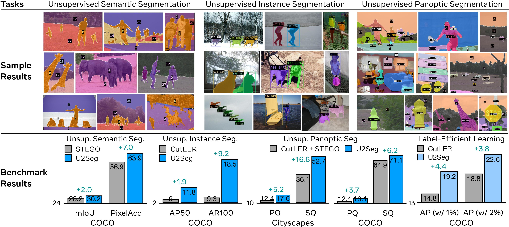
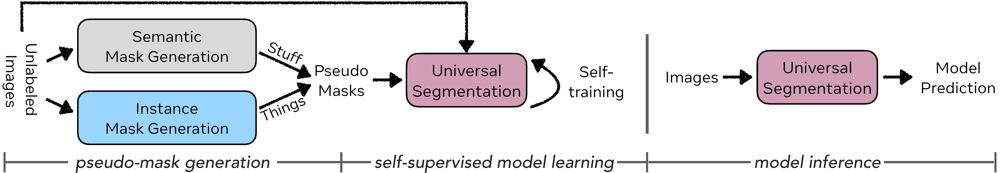

# U2Seg: Unsupervised Universal Image Segmentation

We present **U2Seg**, a unified framework for **U**nsupervised **U**niversal image **Seg**mentation that consistently outperforms previous state-of-the-art methods designed for individual tasks: U2Seg for unsupervised instance segmentation, STEGO for unsupervised semantic segmentation, and the naive combination of U2Seg and STEGO for unsupervised panoptic segmentation.

<p align="center">  </p>

> [**Unsupervised Universal Image Segmentation**](http://people.eecs.berkeley.edu/~xdwang/projects/U2Seg/)            
> [Xudong Wang*](https://people.eecs.berkeley.edu/~xdwang/), [Dantong Niu*](https://scholar.google.com/citations?user=AzlUrvUAAAAJ&hl=en), [Xinyang Han*](https://xinyanghan.github.io/), [Long Lian](https://tonylian.com/), [Roei Herzig](https://roeiherz.github.io/), [Trevor Darrell](https://people.eecs.berkeley.edu/~trevor/)     
> Arxiv

[project page](http://people.eecs.berkeley.edu/~xdwang/projects/U2Seg/) | [arxiv](https://arxiv.org/abs/2301.11320) | [colab](https://colab.research.google.com/drive/1NgEyFHvOfuA2MZZnfNPWg1w5gSr3HOBb?usp=sharing) | [bibtex](#citation)

<!-- ## Features 
- U2Seg is the first universal unsupervised image segmentation model that can tackle unsupervised semantic-aware instance, semantic and panoptic segmentation tasks using a unified framework.
- U2Seg can learn unsupervised object detectors and instance segmentors solely on ImageNet-1K.
- U2Seg exhibits strong robustness to domain shifts when evaluated on 11 different benchmarks across domains like natural images, video frames, paintings, sketches, etc.
- U2Seg can serve as a pretrained model for fully/semi-supervised detection and segmentation tasks. -->

## Installation
See [installation instructions](INSTALL.md).

## Dataset Preparation
See [Preparing Datasets for U2Seg](datasets/README.md).

## Method Overview
<p align="center">
  
</p>

U2Seg has 4 stages: 1) generating pseudo instance masks with MaskCut and clustering, 2) generating pseudo semantic masks with STEGO and 3) merging instance masks, semantic masks to get pseudo labels for panoptic segmentation and 4) learning unsupervised universal segmentor from pseudo-masks of unlabeled data.

## Pseudo Mask Gneration
This part include MaskCut+Clustering, which we use to generate the pseudo for training of U2Seg, additional information will come later. 
For implementers who wants to play with out models, we provide well-processed annotations in Data Preparation.

## Universail Image Segmentation

### Training
After you preparing the dataset following the aboved instruction, you should be able to train the U2Seg universal segmentation model by:

```
python ./tools/train_net.py --eval-only False --config-file configs/COCO-PanopticSegmentation/u2seg_R50.yaml
```
Note: you need to download the pre-trained [dino backbone](https://drive.google.com/file/d/1UtRUgUQK20KS8MGebCWgLPHxrez7mfV4/view?usp=drive_link) and change the path of the corresponding ```yaml``` file.

### Demonstration
we provide the the checkpoint as follows:

here need a table(https://drive.google.com/drive/folders/186GBbIhEW7W0eidGOGRTmTyM_HedSOQh?usp=drive_link)
just put each of these to the table

To run inference on images, you should first assign a checkpoints in the ```u2seg_eval.yaml```, then:
```
python ./demo/u2seg_demo.py --config-file configs/COCO-PanopticSegmentation/u2seg_eval.yaml 
```

 
## License
The majority of U2Seg, Detectron2 and DINO are licensed under the [CC-BY-NC license](LICENSE), however portions of the project are available under separate license terms: TokenCut, Bilateral Solver and CRF are licensed under the MIT license; If you later add other third party code, please keep this license info updated, and please let us know if that component is licensed under something other than CC-BY-NC, MIT, or CC0.

## Ethical Considerations
U2Seg's wide range of detection capabilities may introduce similar challenges to many other visual recognition recognition methods.
As the image can contain arbitrary instances, it may impact the model output.

## How to get support from us?
If you have any general questions, feel free to email us at [Xudong Wang](mailto:xdwang@eecs.berkeley.edu), [Ishan Misra](mailto:imisra@meta.com) and [Rohit Girdhar](mailto:rgirdhar@meta.com). If you have code or implementation-related questions, please feel free to send emails to us or open an issue in this codebase (We recommend that you open an issue in this codebase, because your questions may help others). 

## Citation
If you find our work inspiring or use our codebase in your research, please consider giving a star ⭐ and a citation.
```
@article{wang2023cut,
  title={Cut and Learn for Unsupervised Object Detection and Instance Segmentation},
  author={Wang, Xudong and Girdhar, Rohit and Yu, Stella X and Misra, Ishan},
  journal={arXiv preprint arXiv:2301.11320},
  year={2023}
}
```
